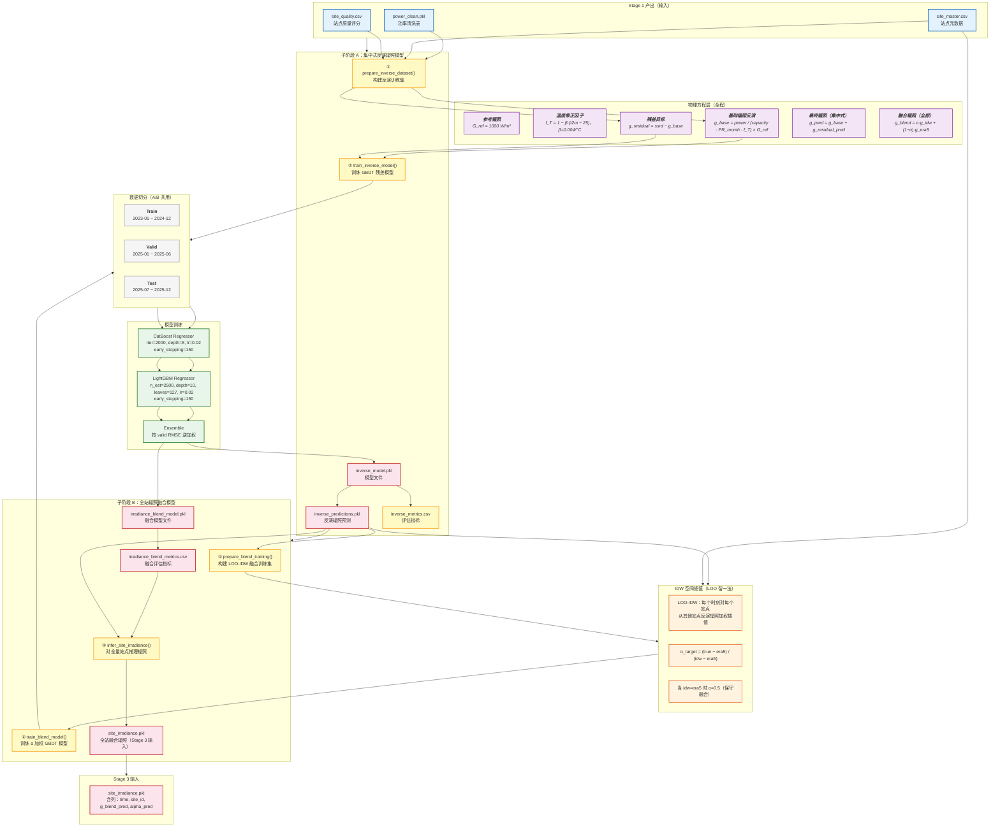

# Stage 2 Framework Diagram — 集中式反演辐照模型



---

## 数据流图（ASCII 纵向展开）

```
┌─────────────────────────────────────────────────────────────────────────┐
│                         Stage 1 产出（输入）                              │
│   power_clean.pkl  │  site_master.csv  │  site_quality.csv              │
└──────────┬──────────────────┬─────────────────────────┬────────────────┘
           │                  │                         │
           ▼                  ▼                         ▼
┌──────────────────────────────────────────────────────────────────────────┐
│              子阶段 A：集中式反演辐照模型（inverse_model）                   │
│                                                                          │
│  ① prepare_inverse_dataset()                                             │
│     ├─ 筛选 dev_type == "集中式" 的站点                                   │
│     ├─ 合并 site_master 元数据（lon/lat/county/coastal_flag）             │
│     ├─ 合并 quality_score                                                 │
│     ├─ estimate_monthly_pr()：按 site×month 计算 PR 月度中位数             │
│     │   PR = power / (capacity × (ssrd/1000) × (1 − 0.004·(t2m−25)))    │
│     ├─ 物理反演基础辐照：g_base = power / (cap·PR_month·f_T) × 1000      │
│     ├─ 定义残差目标：g_residual = ssrd − g_base                          │
│     ├─ add_common_features()：hour, month, hour_sin/cos, doy_sin/cos      │
│     │                      solar_elevation_deg, daylight_model_flag        │
│     ├─ add_lag_features()：power_mw/ssrd/g_base 的 lag1, lag2, diff1, diff2│
│     └─ 场景分类：_scene_label(elev, ssrd, ramp)                            │
│        → night | low (g<120) | ramp (|ramp|>140) | mid | clear_peak      │
│                                                                          │
│  ② train_inverse_model()                                                 │
│     ├─ 过滤：power_mw 非空，ssrd≥0，quality_score≥0.10                     │
│     ├─ 样本权重：                                                          │
│     │   w = (ssrd>250 ? 2.5 : 1.0) × (ramp ? 1.25 : 1.0) × quality_score│
│     ├─ 数据切分：                                                          │
│     │   train = year≤2024                                                │
│     │   valid = year=2025 AND month≤6                                     │
│     │   test  = year=2025 AND month>6                                     │
│     ├─ 模型：CatBoost + LightGBM → 验证集 RMSE 加权 Ensemble                │
│     │   CatBoost: iter=2000, depth=8, lr=0.02, early_stopping=150        │
│     │   LightGBM: n_est=2500, depth=10, leaves=127, lr=0.02               │
│     ├─ 推理：g_residual_pred → g_pred = (g_base + residual_pred).clip(0,1400)│
│     ├─ 重构功率：power_recon = cap·PR·(g_pred/1000)·f_T                    │
│     └─ 指标：irr_MAE, irr_RMSE, irr_NRMSE, irr_Corr, power_recon_RMSE    │
│                                                                          │
│  产出：inverse_model.pkl / inverse_predictions.pkl / inverse_metrics.csv  │
└──────────────────────────┬───────────────────────────────────────────────┘
                           │
                           ▼
┌──────────────────────────────────────────────────────────────────────────┐
│              子阶段 B：全站辐照融合模型（irradiance_blend）                 │
│                                                                          │
│  ① prepare_blend_training()                                              │
│     ├─ 筛选集中式站点（lon/lat 非空）                                      │
│     ├─ LOO-IDW：每个时刻 t，对每个站点 i（共 N 个中心站）                    │
│     │   从其余 N−1 个站点的 g_pred 用反距离加权插值推算 g_idw              │
│     │   idw_predict(lon[-i], lat[-i], g_pred[-i]; lon[i], lat[i])       │
│     ├─ α 目标值计算：                                                     │
│     │   α_target = (true_g − era5) / (idw − era5)，clip 至 [0, 1]        │
│     │   当 idw≈era5 时退化为 α=0.5（保守均值）                             │
│     ├─ 构造空间特征：                                                      │
│     │   g_spatial_std  = std(g_pred[N-1个站])
│     │   g_spatial_mean = mean(g_pred[N-1个站])
│     │   n_sites        = N−1（当日活跃集中式站数）
│     └─ 时间特征：hour, month, year                                         │
│                                                                          │
│  ② train_blend_model()                                                    │
│     ├─ 特征：idw_pred, era5_pred, g_spatial_std, g_spatial_mean,          │
│     │        n_sites, hour, month, county, coastal_flag, site_id          │
│     ├─ 类别：county, site_id                                               │
│     ├─ 数据切分：同上（train≤2024, valid=2025M1-6, test=2025M7-12）        │
│     ├─ 模型：CatBoost + LightGBM → Ensemble                                │
│     ├─ α_pred = predict_bundle(blend_bundle)，clip 至 [0, 1]              │
│     └─ 融合辐照：g_blend = α·g_idw + (1−α)·g_era5                         │
│                                                                          │
│  ③ infer_site_irradiance()                                                │
│     ├─ 目标站点：所有 lon/lat 非空的站点（集中式+分布式）                    │
│     ├─ 同上 LOO-IDW（集中式→所有目标站）                                   │
│     ├─ 推理 α_pred（blend 模型）                                          │
│     └─ 输出：g_blend_pred, alpha_pred, idw_pred, era5_site_ssrd            │
│                                                                          │
│  产出：irradiance_blend_model.pkl / site_irradiance.pkl                  │
│      → 作为 Stage 3 分布式功率模型的输入特征                               │
└──────────────────────────────────────────────────────────────────────────┘
```

---

## 关键公式汇总

### A. 集中式辐照反演（物理层）

| 公式 | 说明 |
|------|------|
| \( f_T = 1 - 0.004 \times (t_{2m} - 25) \) | 温度修正因子，β=0.004/°C |
| \( g_{base} = \dfrac{power}{capacity \times PR_{month} \times f_T} \times 1000 \) | 从功率反推基础辐照 |
| \( PR_{month} = median\left( \dfrac{power}{capacity \times GHI/1000 \times f_T} \right) \) | 按站点×月份的中位数 |
| \( g_{residual} = ssrd - g_{base} \) | ERA5 与基础辐照的残差（模型目标） |
| \( g_{pred} = g_{base} + \hat{g}_{residual} \) | 最终反演辐照（clip 0~1400 W/m²） |

### B. LOO-IDW 空间插值

| 公式 | 说明 |
|------|------|
| \( g_{idw}^{(i)} = \dfrac{\sum_{j \neq i} w_j \cdot g_{pred}^{(j)}}{\sum_{j \neq i} w_j},\quad w_j = \dfrac{1}{d_{ij}^2} \) | 反距离加权（幂次=2） |
| \( \alpha_{target}^{(i)} = \dfrac{g_{true}^{(i)} - ssrd^{(i)}}{g_{idw}^{(i)} - ssrd^{(i)}} \) | 最优融合权重（解析解） |

### C. 辐照融合推理

| 公式 | 说明 |
|------|------|
| \( \hat{\alpha} = \text{GBDT\_Predict}(idw, era5, \sigma_g, \mu_g, n, hour, month, county, flag) \) | 学习 α |
| \( g_{blend} = \hat{\alpha} \times g_{idw} + (1 - \hat{\alpha}) \times g_{era5} \) | 最终辐照融合值 |

---

## 模型配置

| 参数 | 反演模型 | 融合模型 |
|------|---------|---------|
| 主算法 | CatBoost Regressor | CatBoost Regressor |
| 迭代次数 | 2000 | 2000 |
| 树深度 | 8 | 8 |
| 学习率 | 0.02 | 0.02 |
| 早停 | 150 rounds | 150 rounds |
| 副算法 | LightGBM（自动尝试） | LightGBM（自动尝试） |
| 集成策略 | valid RMSE 逆加权 | valid RMSE 逆加权 |
| 备选 | RandomForest | RandomForest |

---

## 评估指标

| 指标 | 反演模型 | 融合模型 |
|------|---------|---------|
| 辐照 RMSE | ✓ irr_rmse | ✓ rmse_blend |
| 辐照 NRMSE | ✓ irr_nrmse | ✓ nrmse_blend |
| 辐照 MAE | ✓ irr_mae | — |
| 辐照相关系数 | ✓ irr_corr | — |
| 功率重构 RMSE | ✓ power_recon_rmse | — |
| IDW 基线 | — | ✓ rmse_idw |
| ERA5 基线 | — | ✓ rmse_era5 |
