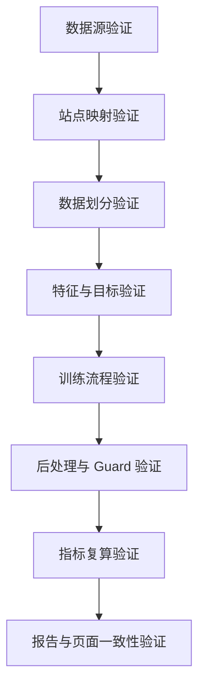

# 当前光伏预测训练流程与结果严谨性验证方案

## 0. 验证目标

本方案用于验证当前光伏预测项目的：

1. **训练过程准确性**：数据读取、清洗、划分、特征、训练、后处理、模型选择流程是否正确。
2. **训练结果准确性**：报告、指标、页面展示是否真实来自最终预测结果，是否存在口径不一致。
3. **实验严谨性**：是否存在测试集泄漏、重复调参、无保护覆盖 final、指标误用、文件混乱等问题。

验证原则：

```text
不重新调参
不用 test 集做模型选择
不修改 final/best 预测结果
只做一致性检查、指标复算、泄漏检查、复现检查、产物追踪
```

---

## 1. 总体验证框架

建议将验证分为 8 个层级：



每一层都要输出明确结论：

```text
PASS / WARN / FAIL
```

其中：

- `PASS`：检查通过。
- `WARN`：有风险，但不影响当前结果解释。
- `FAIL`：结果不可信，必须修复后重新生成报告。

---

## 2. 建议新增验证脚本

建议新增一个总控脚本：

```text
scripts/audit_training_process_and_results.py
```

执行命令：

```bash
python scripts/audit_training_process_and_results.py \
  --output-root output/pv_pipeline \
  --report-path docs/训练过程与结果严谨性验证报告.md
```

输出文件：

```text
output/pv_pipeline/metrics/audit_data_integrity.csv
output/pv_pipeline/metrics/audit_split_integrity.csv
output/pv_pipeline/metrics/audit_metric_recompute.csv
output/pv_pipeline/metrics/audit_final_best_consistency.csv
output/pv_pipeline/metrics/audit_report_page_consistency.csv
output/pv_pipeline/metrics/audit_summary.json
docs/训练过程与结果严谨性验证报告.md
```

---

## 3. 数据源验证

### 3.1 检查目标

确认当前训练使用的数据是否完整、可读、字段齐全。

### 3.2 必查文件

```text
output/pv_pipeline/tables/power_long_raw.pkl
output/pv_pipeline/tables/power_clean.pkl
output/pv_pipeline/tables/site_master.csv
output/pv_pipeline/tables/site_meteo.pkl
output/pv_pipeline/tables/site_irradiance.pkl
output/pv_pipeline/tables/distributed_train_table_v159.pkl
output/pv_pipeline/tables/distributed_predictions_final_eval.pkl
output/pv_pipeline/tables/distributed_predictions_final_full.pkl
output/pv_pipeline/tables/best_predictions_eval.pkl
output/pv_pipeline/tables/best_predictions_full.pkl
```

### 3.3 检查内容

对每个文件输出：

```text
文件名
是否存在
是否可读取
行数
列数
关键字段是否存在
时间范围
站点数
空值比例
重复行数量
```

关键字段：

```text
time
site_id
power_mw
power_pred
capacity_mw
split
hour
date
```

### 3.4 判定标准

| 检查项 | 判定 |
|---|---|
| 关键文件缺失 | FAIL |
| final/best pkl 无法读取 | FAIL |
| final_eval 行数为 0 | FAIL |
| final_eval 缺少 `power_mw` 或 `power_pred` | FAIL |
| 时间字段无法解析 | FAIL |
| 个别辅助文件缺失但不影响 final 验证 | WARN |

---

## 4. 站点映射验证

### 4.1 检查目标

确认站点 ID、站点名称、容量、原始功率列之间映射合理。

### 4.2 检查内容

基于：

```text
site_master.csv
power_mapping.csv
power_mapping_round9_corrected.csv
distributed_predictions_final_eval.pkl
```

输出：

```text
site_id
site_name
capacity_mw
是否有经纬度
是否有功率数据
是否进入 final_eval
test_rows
test_positive_rows
zero_ratio_pct
```

重点检查：

1. 同一个 `site_id` 是否对应多个明显不同站点名。
2. 同一个功率列是否映射到多个站点。
3. `capacity_mw` 是否为空或小于等于 0。
4. final_eval 中是否存在 site_master 不存在的站点。
5. 被排除坏站点是否仍进入 final_eval。

### 4.3 判定标准

| 检查项 | 判定 |
|---|---|
| final_eval 站点无法在 site_master 找到 | FAIL |
| capacity_mw <= 0 | FAIL |
| 一个功率别名映射多个站点且未说明 | WARN/FAIL |
| 映射失败站点未写入报告 | WARN |

---

## 5. 数据划分验证

### 5.1 检查目标

确认 train / valid / test 时间上不重叠，且 test 没有参与模型选择。

### 5.2 检查内容

对所有核心表检查：

```text
distributed_train_table_v159.pkl
distributed_predictions_final_full.pkl
distributed_predictions_final_eval.pkl
best_predictions_eval.pkl
```

统计：

```text
split
最早时间
最晚时间
行数
站点数
```

检查：

```python
train_max_time < valid_min_time
valid_max_time < test_min_time
```

如果不是严格时间顺序，也必须确认：

```text
train / valid / test 的 time-site_id 唯一键不重叠
```

### 5.3 防泄漏检查

检查以下脚本是否读取 test 指标参与选择：

```text
select_final_prediction_by_guard.py
promote_candidate_if_better_round10.py
run_round10_best_guard_pipeline.py
apply_midday_site_nrmse_calibration.py
apply_midday_stable_bias_correction_round6.py
train_midday_specialist_model_round9.py
```

要求：

1. 校准参数只能来自 train/valid。
2. 候选模型选择只能基于 valid 或保底机制。
3. test 只能用于最终评估和报告。

### 5.4 判定标准

| 检查项 | 判定 |
|---|---|
| train/valid/test 存在 time-site 重叠 | FAIL |
| 脚本使用 test 结果调参 | FAIL |
| test 仅用于最终报告 | PASS |
| test oracle 仅作为诊断且未参与 final | WARN/PASS |

---

## 6. 特征与目标验证

### 6.1 检查目标

确认模型目标和特征合理，预测结果没有物理越界。

### 6.2 目标字段检查

确认分布式预测目标为：

```text
power_mw
```

如果中间模型使用容量归一化目标，需要检查：

```text
y = power_mw / capacity_mw
power_pred = y_pred * capacity_mw
```

### 6.3 物理范围检查

对 final_eval 检查：

```python
power_pred >= 0
power_pred <= capacity_mw * tolerance
```

建议容忍：

```text
tolerance = 1.02
```

输出：

```text
负预测数量
超过容量预测数量
超过容量 2% 数量
超过容量 10% 数量
```

### 6.4 时间特征检查

确认：

```text
hour 与 time.dt.hour 一致
date 与 time.dt.date 一致
```

### 6.5 判定标准

| 检查项 | 判定 |
|---|---|
| power_pred 大量小于 0 | FAIL |
| power_pred 大量超过容量 | FAIL |
| hour/date 与 time 不一致 | FAIL |
| 少量浮点误差越界且已裁剪 | WARN |

---

## 7. 训练流程验证

### 7.1 检查目标

确认训练流程能够从原始数据到 final 结果闭环运行。

### 7.2 检查 train_fixed.py

检查：

```text
scripts/train_fixed.py
```

是否包含关键步骤：

```text
数据准备
集中式辐照反演
分布式预测
P0/P1 修正
MiddaySiteCalibrated
Guard 选择
best guard 保护
指标生成
报告更新
一致性检查
```

### 7.3 关键脚本运行顺序验证

输出 `audit_pipeline_order.csv`：

```text
step
script
exists
is_critical
expected_output
output_exists
status
```

### 7.4 判定标准

| 检查项 | 判定 |
|---|---|
| critical script 缺失 | FAIL |
| critical output 缺失 | FAIL |
| best guard 未接入最终流程 | WARN/FAIL |
| 训练流程只靠手工拼接 | WARN |

---

## 8. 后处理与 Guard 验证

### 8.1 检查目标

确认 final 不是被较差候选覆盖，当前版本始终等于最优版本。

### 8.2 必查文件

```text
output/pv_pipeline/tables/distributed_predictions_final_eval.pkl
output/pv_pipeline/tables/best_predictions_eval.pkl
output/pv_pipeline/metrics/round10_final_is_best_check.csv
output/pv_pipeline/metrics/round10_final_vs_best_nrmse.csv
output/pv_pipeline/metrics/round11_candidate_leaderboard.csv
```

### 8.3 检查内容

1. final_eval 与 best_eval 行数一致。
2. final_eval 与 best_eval 的 `time + site_id` 一致。
3. final_eval 与 best_eval 的 `power_pred` 差值最大值为 0 或接近 0。
4. 被拒绝候选没有覆盖 final。
5. candidate leaderboard 中 accepted=false 的候选原因明确。

### 8.4 判定标准

| 检查项 | 判定 |
|---|---|
| final != best 且无晋级记录 | FAIL |
| rejected 候选覆盖 final | FAIL |
| final = best | PASS |
| 候选拒绝原因明确 | PASS |

---

## 9. 指标复算验证

### 9.1 检查目标

确认报告中的 MAE、RMSE、NRMSE、bias、pred/actual ratio 等指标不是手填错误。

### 9.2 从 final_eval 重新计算整体指标

读取：

```text
distributed_predictions_final_eval.pkl
```

筛选：

```python
df = df[df["split"].eq("test")]
df = df[df["hour"].between(6, 19)]
df = df[df["power_mw"].notna() & df["power_pred"].notna()]
```

计算：

```python
MAE = mean(abs(power_pred - power_mw))
RMSE = sqrt(mean((power_pred - power_mw)^2))
NRMSE = RMSE / mean(capacity_mw) * 100
bias = (sum(power_pred) - sum(power_mw)) / sum(power_mw) * 100
pred_actual_ratio = sum(power_pred) / sum(power_mw)
```

与以下文件对比：

```text
round10_overall_nrmse_summary.csv
round7_final_overall_metrics.csv
光伏功率预测项目.md
```

### 9.3 逐小时指标复算

重新计算：

```text
小时（时）
样本数（行）
站点平均 NRMSE（%）
城市 NRMSE（%）
```

对比：

```text
分布式光伏预测_逐小时平均NRMSE.csv
interactive_dashboard/hourly_prediction_summary.json
光伏功率预测项目.md 3.3.4 逐小时 NRMSE 结果
```

### 9.4 站点指标复算

按站点计算：

```text
site_id
rows
MAE
RMSE
NRMSE
bias
pred_actual_ratio
```

对比：

```text
interactive_dashboard/scatter_site_sample_nrmse.json
分布式光伏预测_各站点平均相对误差统计.csv
```

### 9.5 允许误差

| 指标 | 允许差异 |
|---|---:|
| MAE/RMSE | 1e-4 |
| NRMSE | 0.01 个百分点 |
| bias | 0.01 个百分点 |
| pred/actual ratio | 1e-4 |
| rows | 必须完全一致 |

### 9.6 判定标准

| 检查项 | 判定 |
|---|---|
| 指标复算与报告不一致 | FAIL |
| rows 不一致 | FAIL |
| 仅四舍五入差异 | PASS |

---

## 10. 报告与页面一致性验证

### 10.1 检查目标

确认 Markdown 报告、交互页面和 CSV/PKL 产物一致。

### 10.2 必查文件

```text
光伏功率预测项目.md
docs/Round11_执行报告.md
stages/05_visualization/interactive_forecast_dashboard.html
output/pv_pipeline/interactive_dashboard/*.json
```

### 10.3 检查内容

1. 报告中的整体 NRMSE 是否等于 final_eval 复算结果。
2. 报告中的逐小时结果是否等于 `hourly_prediction_summary.json`。
3. 页面中的站点样本量是否使用全量历史样本数。
4. 页面中的散点图纵轴是否为 test NRMSE。
5. 页面说明是否明确：

```text
全量样本量来自 full 表
测试 NRMSE 来自 test 6-19 点
页面不参与模型训练和模型选择
```

### 10.4 判定标准

| 检查项 | 判定 |
|---|---|
| 页面指标与 final_eval 不一致 | FAIL |
| 报告仍写 MAPE/WAPE 作为主指标 | WARN/FAIL |
| 页面说明口径清楚 | PASS |

---

## 11. 可复现性验证

### 11.1 检查目标

确认同一份代码和同一份输入数据可以重复得到一致结果。

### 11.2 最低可复现要求

由于完整训练耗时较长，建议分两级：

#### 轻量复现

只运行：

```bash
python scripts/run_round10_best_guard_pipeline.py
python scripts/regenerate_final_metrics_round7.py
python scripts/compute_nrmse_reports_round10.py
python scripts/export_interactive_dashboard_data.py \
  --output-root output/pv_pipeline \
  --dashboard-root output/pv_pipeline/interactive_dashboard
```

验证：

```text
final 不变
best 不变
整体指标不变
逐小时指标不变
页面 JSON 可重新生成
```

#### 完整复现

如果需要最终交付前严谨验证，再运行：

```bash
python scripts/train_fixed.py
```

运行前必须备份当前 final/best：

```text
output/pv_pipeline/backup_before_reproduce/
```

运行后对比：

```text
final_eval 行数
整体 NRMSE
逐小时 NRMSE
站点 NRMSE
best guard 是否回退
```

### 11.3 判定标准

| 检查项 | 判定 |
|---|---|
| 轻量复现指标完全一致 | PASS |
| 完整复现差异在随机模型可解释范围内 | WARN |
| 完整复现显著变差且未回退 best | FAIL |

---

## 12. 建议审计报告结构

生成：

```text
docs/训练过程与结果严谨性验证报告.md
```

报告结构：

```markdown
# 训练过程与结果严谨性验证报告

## 1. 验证结论

| 模块 | 结论 | 说明 |
|---|---|---|
| 数据源完整性 | PASS/WARN/FAIL | ... |
| 站点映射 | PASS/WARN/FAIL | ... |
| 数据划分 | PASS/WARN/FAIL | ... |
| 测试集泄漏 | PASS/WARN/FAIL | ... |
| 物理范围 | PASS/WARN/FAIL | ... |
| final/best 一致性 | PASS/WARN/FAIL | ... |
| 指标复算 | PASS/WARN/FAIL | ... |
| 报告页面一致性 | PASS/WARN/FAIL | ... |

## 2. 当前 final 结果复算

## 3. 逐小时结果复算

## 4. 站点级结果复算

## 5. final 与 best 保护机制

## 6. 测试集泄漏检查

## 7. 页面与报告一致性

## 8. 风险项与修复建议
```

---

## 13. 最终判定规则

建议最终结论分为三档。

### A 档：可交付

必须满足：

```text
数据文件完整
train/valid/test 不重叠
无 test 调参
final = best
整体指标复算一致
逐小时指标复算一致
报告和页面口径一致
```

### B 档：可内部演示，需说明风险

满足：

```text
主要指标一致
无明显数据泄漏
但存在部分站点映射、样本量解释、报告文案风险
```

### C 档：不可交付

出现任一情况：

```text
final/best 不一致且无法解释
测试集参与调参
报告指标无法从 final_eval 复算
核心文件缺失
预测值物理越界严重
页面展示口径与报告不一致
```

---

## 14. 本项目当前重点应验证的问题

结合当前项目历史，优先验证以下 8 项：

1. `final_eval` 是否仍等于 `best_eval`。
2. Round9/Round10/Round11 被拒绝候选是否没有覆盖 final。
3. `mae_mw` 和 `rmse_mw` 是否没有再次混淆。
4. 10-14 点站点平均 NRMSE 是否和报告一致。
5. 城市 NRMSE 与站点平均 NRMSE 是否口径区分清楚。
6. 交互页面样本量是否已经改为 `full_history_rows`。
7. 页面中的 test NRMSE 是否只来自 test 6-19 点。
8. `光伏功率预测项目.md` 是否没有残留 WAPE/MAPE 主指标描述。

---

## 15. Cursor 执行建议

请 Cursor 先实现：

```text
scripts/audit_training_process_and_results.py
```

第一版不需要覆盖所有复杂逻辑，至少完成：

1. final/best 一致性检查。
2. split 重叠检查。
3. 整体指标复算。
4. 逐小时指标复算。
5. 页面 JSON 与 final_eval 一致性检查。
6. 自动生成 Markdown 审计报告。

第一版通过后，再补充：

1. 脚本源码层面的 test 泄漏扫描。
2. 站点映射异常扫描。
3. 物理范围和容量异常扫描。
4. 可复现性哈希记录。

